# Lab03-WordGuessGame
CF 401 Lab 3 - Word Guessing Game (System.IO)

## Introduction to Word Guessing Game
This application is a game with both player and administrative interfaces. A player can choose to play a round, wherein (s)he guesses letters in a word of specified length (source: chosen at random from an external file of administrator chosen words), and (s)he is given immediate feedback on whether the letter is or isn't in the word. Play continues until the player guesses the word or exits. The administrator can view and modify the word list from the external file.

## Visuals
These sample session images show:
 - Main Menu
 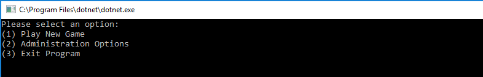
 - Game In Play
 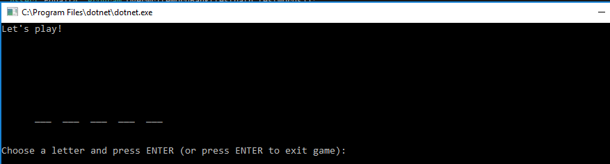
 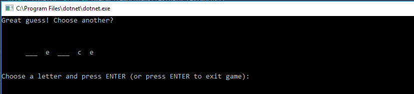
 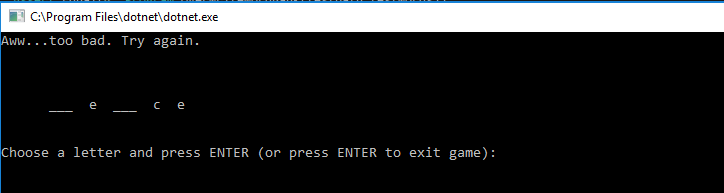
 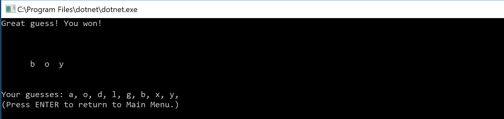
 - Admin Menu
 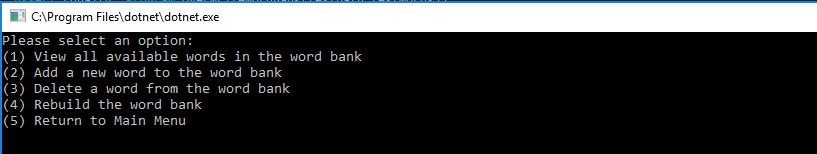
 - Viewing words in word bank
 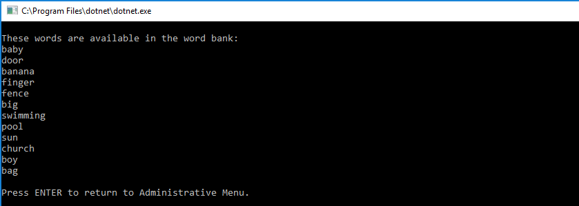
 - Adding a word to the word bank
 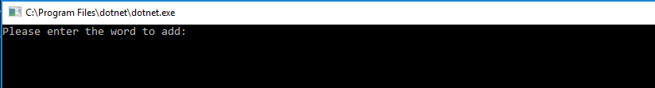
 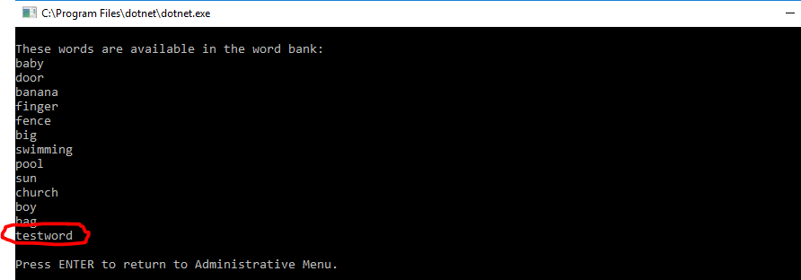
 - Deleting a word from the word bank
 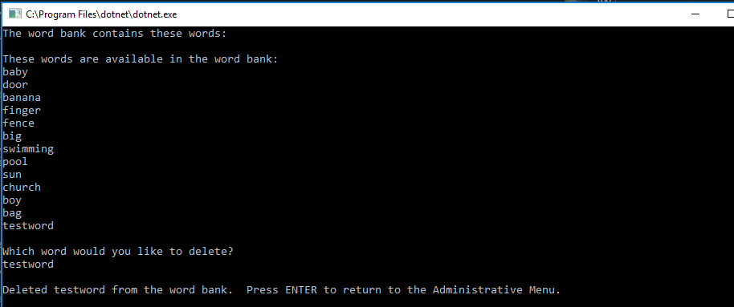
 - Re-initializing the word bank
 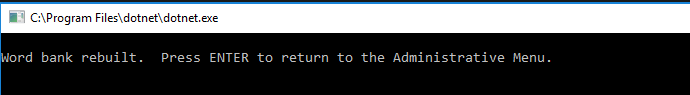
 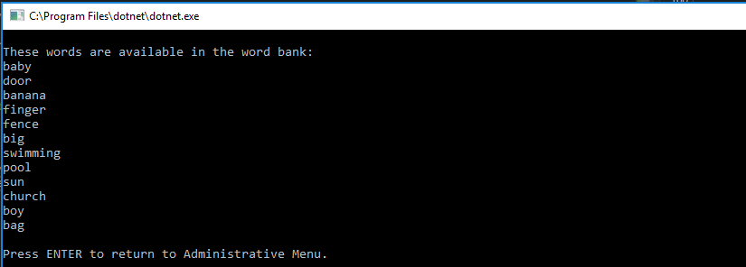

## How to use
The application automatically initializes an external file of words (word bank) and launches a console window upon compile/run, and a menu of options is presented. Interaction requires only input of selections (1 to play, 2 for admin menu, or 3 to exit). Selecting 3 (exit) will end the session, and making an invalid selection will only reset the menu (exceptions will prompt for reset). 
1 - New Game
Game play begins with a word being randomly selected from word bank, which is converted to an array of characters. The game board is populated with an underline/blank for each letter in the selected word. The user enters letters as guesses (numbers and special characters are rejected, and exceptions are caught and played-through). The guess is compared to the letters array - all matching letters will be displayed in the game board along with underline/blanks for any letters not yet guessed. Rounds repeat until the entire word has been revealed through correct guesses or the user chooses to quit, and all guesses to that point are displayed for review.
2 - Admin Menu
The admin menu contains options to view the word bank, add to or delete from the word bank, rebuild the word bank (ie - re-initialize from the list used to populate it at program launch), and return to the main menu. Invalid selections are rejected; exceptions are caught and thrown back to the caller (ie - menu is reset).

## Other details
Unit tests confirm that the word bank can be updated, that a word can be added to the word bank, that all words can be retrieved from the word bank, and that a guess can accurately be confirmed as correct and incorrect.
